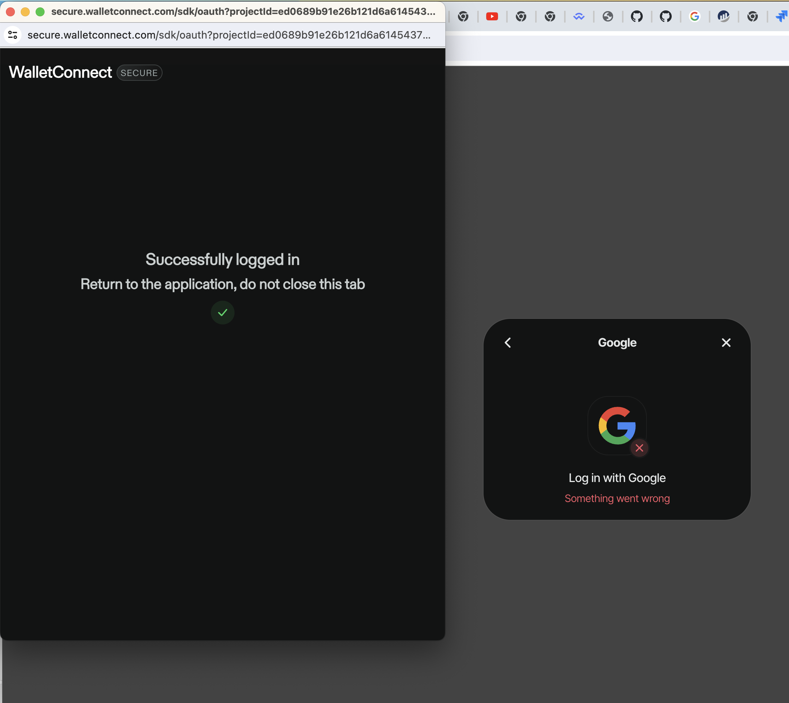

This example is about showing social media login and login via email.

Currently login  by email works, but login via social media such as Google does not.

Switch to node v20.12.2

If you have nvm you can do:

   nvm install v20.12.2

If you already have it and want to switch to it using nvm:

  nvm use v20.12.2

Run:

npm install
npm run dev